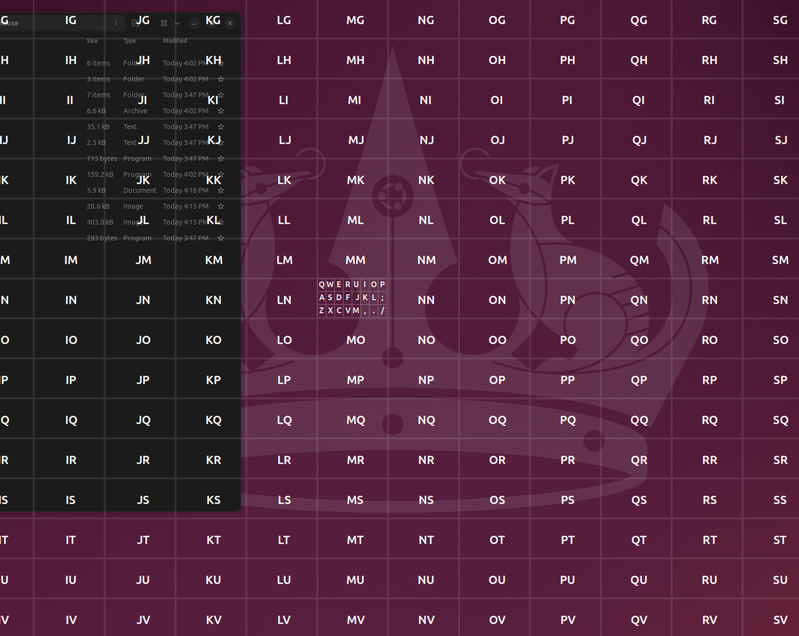

# GNOMouse

## Intro

GNOMouse is a [GNOME Shell Extension](https://extensions.gnome.org) which enables you to use your keyboard instead of your mouse for the following mouse events: movement, right-click, left-click, double-click, and drag.  Currently only works on GNOME 46 with X11.

GNOMouse is inspired by the [Mouseless product](https://mouseless.click), which offers support for non-QWERTY keyboards, multiple screens, keystroke customization, localization, layout customization, and works the same across all major desktop platforms.  You may want to consider that product for its enhanced functionality.  The author of GNOMouse has no affiliation with the Mouseless product.

## Build

```bash
make clean
make build
```

## Install

```bash
# Only run this 'make setup' command once
# It will ensure your system settings permit installation of user-built GNOME Shell Extensions
make setup
# Now install the .zip extension package
make install
```

In order to install user-built GNOME Shell Extension .zip packages, your system must have the following settings.  The above `make setup` command makes sure these settings are configured correctly for you:

```bash
# `make setup` runs these commands for you
gsettings set org.gnome.shell disable-user-extensions false
gsettings set org.gnome.shell development-tools true

# If you wish to revert these settings then run these commands:
gsettings set org.gnome.shell disable-user-extensions true
gsettings set org.gnome.shell development-tools false
```

Finally, and this is critical, after installing any extension you must **RESTART YOUR GNOME SHELL**, otherwise your extension will not be loaded or running. 

To restart your GNOME Shell:
- On X11: Alt+F2, r, ENTER
- On Wayland: Log out and then log back in

## Usage

GNOMouse works by enabling an overlay grid which shows labeled cells that you can jump your mouse cursor to by typing the letter(s) in the desired cell.  You can toggle overlay mode on/off using the SUPER+G button.  ESC will also disable overlay mode.  When you toggle overlay mode on, if you want to perform a mouse operation other than just moving the mouse, then before you specify the grid cell to jump (by typing its letters) to you should indicate the mouse operation you wish to perform (right-click, left-click, double-click, drag) and then type the letters for the cell in which you want this operation to occur.  If you indicate that you want to perform a drag, then after selecting the initial sub-cell you'll be able to specify a destination for the drag operation by selecting a second sub-cell.

The possible mouse operations and their associated keys are these:

- Left-Click Mouse: SPACE
- Right-Click: BACKSPACE
- Double-Click: ENTER
- Click-and-Drag: CTRL+SPACE
- Cancel (cancels ALL operations - cursor movement, dragging, etc, and exits overlay mode): ESC or SUPER+G

The overylay itself uses two grids, a top-level 26x26 grid where each cell in this grid is labeled with two letters (A-Z and A-Z) which must be typed to select that cell.  Once a top-level cell has been selected then a sub-cell may be selected within that cell to indicate the center of the mouse location for the operation.  The sub-cells are labeled like this:

```
Q W E R U I O P
A S D F J K L ;
Z X C V M , . /
```

### Examples

To jump the mouse-cursor to a given location:
- Press SUPER+G to initiate overlay mode
- Press the two characters inside the top-level cell (such as by typing A and then A again to specify the cell in the top left corner of the screen)
- Press a single character to specify the sub-cell you wish to move to (such as by pressing D to move to that sub-cell)

To move the mouse-cursor to a given location and left-click that location:
- Press SUPER+G to initiate overlay mode
- Press SPACE to indicate that you want a left-click operation
- Press the two characters inside the top-level cell (such as by typing A and then A again to specify the cell in the top left corner of the screen)
- Press a single character to specify the sub-cell you wish to move to (such as by pressing D to move to that sub-cell)

To move the mouse-cursor to a given location and right-click that location:
- Press SUPER+G to initiate overlay mode
- Press BACKSPACE to indicate that you want a right-click operation
- Press the two characters inside the top-level cell (such as by typing A and then A again to specify the cell in the top left corner of the screen)
- Press a single character to specify the sub-cell you wish to move to (such as by pressing D to move to that sub-cell)

To move the mouse-cursor to a given location and double-click that location:
- Press SUPER+G to initiate overlay mode
- Press ENTER to indicate that you want a double-click operation
- Press the two characters inside the top-level cell (such as by typing A and then A again to specify the cell in the top left corner of the screen)
- Press a single character to specify the sub-cell you wish to move to (such as by pressing D to move to that sub-cell)

To drag from one location to another location:
- Press SUPER+G to initiate overlay mode
- Press CTRL+SPACE to indicate that you are performing a drag operation
- Press the two characters to specify the top-level cell, then one character to specify the subcell, of the location you want the drag to begin
- Press the two characters to specify the top-level cell, then one character to specify the subcell, of the location you want the drag to end

## Screenshots

This is what the grid looks like when you trigger overlay mode.  It covers the entire screen, yet it is transparent so that you can see the desktop behind it.  You type the two letters on the label of the cell you want the mouse to move to.


This is what the grid looks like when you have selected a cell in the top-most grid.  It shows an ever finer-resolution sub-grid with single letter labels.  Type the single letter for the final mouse move.




## Issues

Currently only supports GNOME 46 on X11 (has not been tested on Wayland).  I tested this out on GNOME 48 and while the overlay does display, the mouse cursor dosn't move to the selected sub-cell.

## Copyright and License

GNOMouse is Copyright (c) 2025 by Nathan S. Bushman, and is licensed under the GPL v3 license.